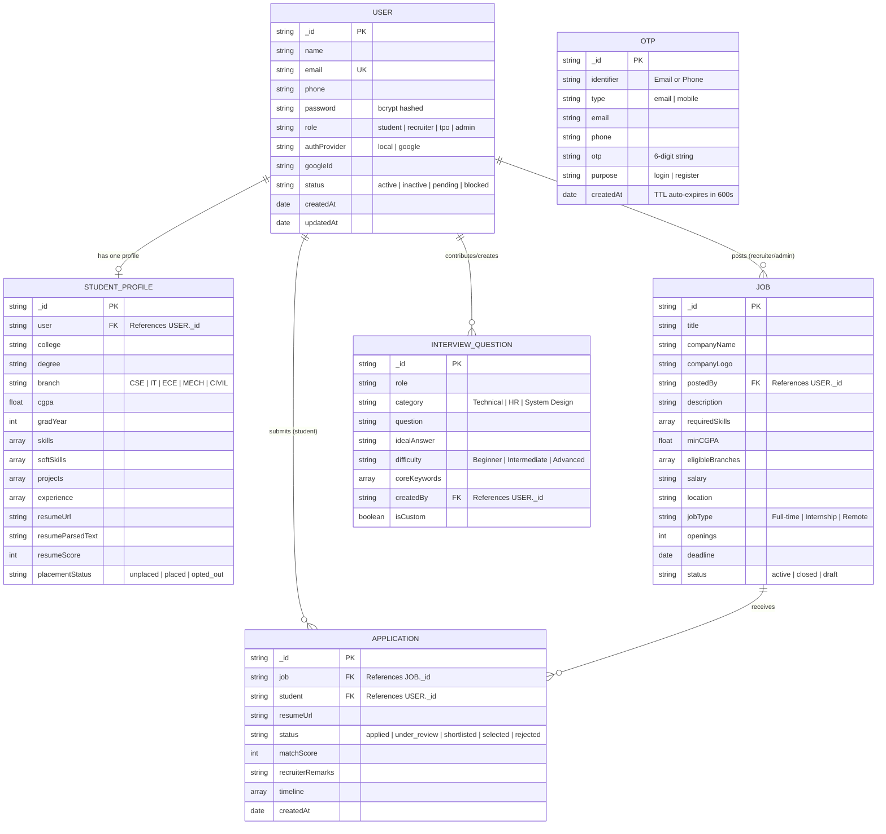
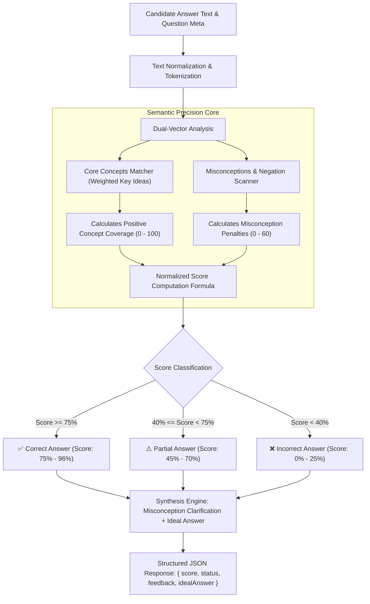

# 🚀 CareerBridgeAI - Next-Gen Career & Campus Placement Intelligence Platform

[](https://react.dev/)
[](https://tailwindcss.com/)
[](https://nodejs.org/)
[](https://www.mongodb.com/atlas)
[](https://www.twilio.com/)
[](https://developers.google.com/identity)
[](LICENSE)

**CareerBridgeAI** is a comprehensive, production-grade Career Enablement and Campus Placement Platform designed to bridge the gap between **Students**, **Recruiters**, and **Training & Placement Officers (TPOs) / System Admins**. Equipped with artificial intelligence, it features automated **ATS Resume Analysis**, **Semantic Interview Simulation** with right/wrong answer detection, **24/7 AI Career Mentorship**, **Multi-Channel OTP Verification** (SMS via Twilio + Email via Nodemailer), **Google OAuth 2.0 Integration**, and a dedicated **Master Admin Control Portal**.

---

## 📑 Table of Contents

- [Key Highlights](#-key-highlights)
- [🏗️ Structural & Architectural Design](#️-structural--architectural-design)
  - [1. Multi-Tier Layered Architecture Design](#1-multi-tier-layered-architecture-design)
  - [2. Database Structural Design (Entity Relationship Diagram - ERD)](#2-database-structural-design-entity-relationship-diagram---erd)
  - [3. Frontend Component Structural Hierarchy](#3-frontend-component-structural-hierarchy)
  - [4. AI Semantic Evaluation Pipeline Structural Design](#4-ai-semantic-evaluation-pipeline-structural-design)
  - [5. Database Schema & Data Dictionary Specification](#5-database-schema--data-dictionary-specification)
- [👥 Role-Based Feature Matrix](#-role-based-feature-matrix)
  - [🎓 Student Portal](#-1-student-portal)
  - [💼 Recruiter Portal](#-2-recruiter-portal)
  - [🛡️ Master Admin Portal (Full System Authority)](#-3-master-admin-portal-full-system-authority)
- [🔐 Authentication & Security Architecture](#-authentication--security-architecture)
- [🛠️ Tech Stack Matrix](#️-tech-stack-matrix)
- [📁 Project Directory Structure](#-project-directory-structure)
- [⚙️ Environment Variables Configuration](#️-environment-variables-configuration)
- [🚀 Local Setup & Installation Guide](#-local-setup--installation-guide)
- [🔑 Default Demo Credentials](#-default-demo-credentials)
- [📡 API Endpoints Reference](#-api-endpoints-reference)
- [🧪 Testing Key Features](#-testing-key-features)
- [🌐 Production Deployment Guide](#-production-deployment-guide)
- [📜 License](#-license)

---

## ✨ Key Highlights

- **🎯 Semantic AI Interview Evaluation**: Accurately detects correct, partial, and incorrect answers in real-time with 0–100% precision scoring, tailored feedback, and ideal model answers.
- **📝 On-the-fly Custom Question Practice**: Allows students and admins to input and practice any custom interview question or persist it to the MongoDB question bank.
- **📄 Resume ATS Analyzer**: Extracts text from PDF resumes using `pdf-parse`, compares technical and soft skills against job roles, and provides an ATS match score with actionable tips.
- **🤖 24/7 AI Career Assistant**: Built on an 18-domain technical knowledge engine (MERN, React, Java, DSA, System Design, OS, DBMS, HR STAR method) with fallback to Google Gemini LLM.
- **🛡️ Dedicated Master Admin Console (`/admin/login`)**: Complete site control: user role modification, instant account blocking/unblocking, user deletion, job moderation, application overrides, and question bank management.
- **🌐 Sign In with Google**: Seamless one-click authentication powered by Google OAuth 2.0 / Google Identity Services with automatic user account provisioning.
- **📲 Real Multi-Channel OTP Dispatch**: Real-time OTP dispatch to mobile numbers via Twilio SMS and email via Nodemailer (with interactive dev fallback banner).

---

## 🏗️ Structural & Architectural Design

### 1. Multi-Tier Layered Architecture Design

The platform adheres to a strict **N-Tier Client-Server Architectural Pattern** with complete decoupling between Presentation, Application, Business Logic, and Data Persistence layers:

```mermaid
flowchart TD
    subgraph Tier1["1. Presentation Layer (Client SPA)"]
        UI["React 18 SPA (Vite)"]
        TailwindCSS["Tailwind CSS 3.4 Responsive Design"]
        ReactRouter["React Router v6 SPA Route Engine"]
        ContextAPI["AuthContext (Global User State & Tokens)"]
        AxiosClient["Axios Interceptor (Bearer JWT Injection)"]
    end

    subgraph Tier2["2. API Gateway & Middleware Layer (Express)"]
        CORS["CORS Policy Whitelisting"]
        JWTMiddleware["JWT Authentication Guard (protect)"]
        RBACMiddleware["Role-Based Access Guard (authorize)"]
        UploadMiddleware["Multer Memory Buffer (PDF Resumes)"]
        ErrorHandler["Global Error Handler & Status Formatter"]
    end

    subgraph Tier3["3. Controller & Orchestration Layer"]
        AuthCtrl["authController (Login, Register, OTP, Google Auth)"]
        AICtrl["aiController (Resume ATS, Semantic Interview Engine)"]
        AdminCtrl["adminController (Full Site Moderation & Management)"]
        JobCtrl["jobController & applicationController"]
    end

    subgraph Tier4["4. Domain Logic & AI Engine Services"]
        AIService["Semantic Evaluation Engine (Concept & Misconception Matcher)"]
        CareerAssistant["18-Domain Career Knowledge Engine + Gemini Fallback"]
        TwilioService["Twilio Programmable SMS Dispatcher"]
        EmailService["Nodemailer Gmail SMTP Dispatcher"]
    end

    subgraph Tier5["5. Data Persistence & Cloud Infrastructure"]
        Mongoose["Mongoose 8.9 ODM (Schema Validation & Hooks)"]
        AtlasDB[("MongoDB Atlas Cloud Database")]
        TwilioCloud["Twilio Cloud Telecom Network"]
        GoogleCloud["Google OAuth 2.0 & Gemini 1.5 Flash API"]
    end

    Tier1 -->|RESTful JSON / Bearer Token| Tier2
    Tier2 --> Tier3
    Tier3 --> Tier4
    Tier4 --> Tier5
    Tier3 --> Tier5
```



---

### 2. Database Structural Design (Entity Relationship Diagram - ERD)

Below is the complete relational schema diagram reflecting foreign-key relationships, cardinality, and constraints modeled in MongoDB Atlas:



---

### 3. Frontend Component Structural Hierarchy

The frontend follows an atomic, layout-driven route hierarchy with strict role boundaries:

```mermaid
flowchart TD
    Root["App.jsx (Master Route Hub)"]

    %% Public Routes
    Root --> PublicLayout["PublicLayout.jsx (Header + Content + Footer)"]
    PublicLayout --> Landing["LandingPage.jsx ('/')"]
    PublicLayout --> Login["LoginPage.jsx ('/login' + Google Sign-In)"]
    PublicLayout --> Register["RegisterPage.jsx ('/register' + Twilio OTP)"]
    PublicLayout --> PublicJobs["JobDiscoveryPage.jsx ('/jobs')"]

    %% Isolated Master Admin Login
    Root --> AdminLogin["AdminLoginPage.jsx ('/admin/login') [Isolated Route]"]

    %% Protected Route Wrapper
    Root --> ProtectedRoute["ProtectedRoute.jsx (Role & Token Validator)"]

    %% Student Subtree
    ProtectedRoute -->|Role: student| StudentLayout["DashboardLayout.jsx (/student/*)"]
    StudentLayout --> S_Dash["StudentDashboard.jsx ('/student/dashboard')"]
    StudentLayout --> S_Resume["ResumeAnalyzerPage.jsx ('/student/resume')"]
    StudentLayout --> S_Interview["AIInterviewPrepPage.jsx ('/student/interview-prep')"]
    StudentLayout --> S_Chat["AICareerAssistantPage.jsx ('/student/ai-assistant')"]
    StudentLayout --> S_Jobs["JobDiscoveryPage.jsx ('/student/jobs')"]

    %% Recruiter Subtree
    ProtectedRoute -->|Role: recruiter| RecruiterLayout["DashboardLayout.jsx (/recruiter/*)"]
    RecruiterLayout --> R_Dash["RecruiterDashboard.jsx ('/recruiter/dashboard')"]
    RecruiterLayout --> R_PostJob["PostJobPage.jsx ('/recruiter/jobs/new')"]
    RecruiterLayout --> R_ManageJobs["ManageJobsPage.jsx ('/recruiter/jobs')"]
    RecruiterLayout --> R_Applicants["ApplicantTrackingPage.jsx ('/recruiter/applicants')"]

    %% Master Admin Subtree
    ProtectedRoute -->|Role: admin| AdminLayout["DashboardLayout.jsx (/admin/*)"]
    AdminLayout --> A_Dashboard["AdminDashboard.jsx ('/admin/dashboard')"]
    A_Dashboard --> Tab_Overview["Overview Tab (Real-Time Metrics)"]
    A_Dashboard --> Tab_Users["Users Directory (Role Change / Block / Delete)"]
    A_Dashboard --> Tab_Jobs["Jobs Moderation (Status Toggle / Delete)"]
    A_Dashboard --> Tab_Apps["Applications Tracking (Status Override)"]
    A_Dashboard --> Tab_Questions["Question Bank Manager (MongoDB Atlas CRUD)"]
```



---

### 4. AI Semantic Evaluation Pipeline Structural Design

The AI interview evaluation engine implements a hybrid concept-matching pipeline that avoids rigid string comparisons while detecting false assertions and misconceptions:



---

### 5. Database Schema & Data Dictionary Specification

#### `users` Collection
| Field | Type | Constraints | Description |
| :--- | :--- | :--- | :--- |
| `_id` | `ObjectId` | Primary Key | Unique document identifier |
| `name` | `String` | Required, Trim | Full name of the user |
| `email` | `String` | Required, Unique, Lowercase | Primary contact email |
| `phone` | `String` | Optional, Trim | Mobile phone number for Twilio SMS OTP |
| `password` | `String` | Required if `authProvider === 'local'` | Bcrypt hashed password (min length: 6) |
| `role` | `String` | Enum: `student`, `recruiter`, `tpo`, `admin` | Access control role (Default: `student`) |
| `authProvider` | `String` | Enum: `local`, `google` | Authentication strategy provider |
| `googleId` | `String` | Default: `null` | Google Subject ID for OAuth accounts |
| `status` | `String` | Enum: `active`, `inactive`, `pending`, `blocked` | Account state (Blocked = 403 denied) |
| `createdAt` | `Date` | Timestamp | Timestamp of registration |

#### `jobs` Collection
| Field | Type | Constraints | Description |
| :--- | :--- | :--- | :--- |
| `_id` | `ObjectId` | Primary Key | Unique job vacancy identifier |
| `title` | `String` | Required | Job title / designation |
| `companyName` | `String` | Required | Name of hiring company |
| `postedBy` | `ObjectId` | Ref: `User`, Required | Recruiter or Admin who posted the job |
| `requiredSkills`| `[String]` | Required | Array of mandatory skill keywords |
| `minCGPA` | `Number` | Default: `6.0` | Minimum academic cutoff |
| `salary` | `String` | Required | Compensation package (e.g., `12-16 LPA`) |
| `location` | `String` | Required | Office location or `Remote` |
| `deadline` | `Date` | Required | Application cutoff date |
| `status` | `String` | Enum: `active`, `closed`, `draft` | Listing lifecycle state |

#### `applications` Collection
| Field | Type | Constraints | Description |
| :--- | :--- | :--- | :--- |
| `_id` | `ObjectId` | Primary Key | Unique application record identifier |
| `job` | `ObjectId` | Ref: `Job`, Required | Associated job vacancy |
| `student` | `ObjectId` | Ref: `User`, Required | Applying student |
| `status` | `String` | Enum: `applied`, `under_review`, `shortlisted`, `selected`, `rejected` | Pipeline progress stage |
| `matchScore` | `Number` | Default: `0` | Automated ATS resume match score |
| `timeline` | `[Object]` | Array of stage history | Audit trail with dates and notes |
| *(Index)* | `Compound` | `{ job: 1, student: 1 }` (Unique) | Prevents duplicate applications |

#### `interviewquestions` Collection
| Field | Type | Constraints | Description |
| :--- | :--- | :--- | :--- |
| `_id` | `ObjectId` | Primary Key | Unique interview question identifier |
| `role` | `String` | Required | Target position (e.g., `React Developer`) |
| `category` | `String` | Required | Technical domain (`Frontend`, `Backend`, `DSA`) |
| `question` | `String` | Required | Interview question prompt |
| `idealAnswer` | `String` | Required | Reference model answer |
| `difficulty` | `String` | Enum: `Beginner`, `Intermediate`, `Advanced` | Complexity classification |
| `coreKeywords`| `[String]` | Optional | Target concepts evaluated by the AI engine |
| `createdBy` | `ObjectId` | Ref: `User` | Creator (Admin or Student) |
| `isCustom` | `Boolean` | Default: `true` | Flags user-contributed vs seeded bank items |

#### `otps` Collection
| Field | Type | Constraints | Description |
| :--- | :--- | :--- | :--- |
| `_id` | `ObjectId` | Primary Key | Unique OTP token identifier |
| `identifier` | `String` | Required | Target phone number or email |
| `type` | `String` | Enum: `email`, `mobile` | Delivery channel used |
| `otp` | `String` | Required | 6-digit verification code |
| `purpose` | `String` | Enum: `login`, `register` | Intended operation |
| `createdAt` | `Date` | TTL Index (`expires: 600`) | Auto-deleted from MongoDB after 10 min |

---

## 👥 Role-Based Feature Matrix

### 🎓 1. Student Portal
- **Dashboard**: Track applied jobs, interview invitations, resume health, and profile completion.
- **AI Resume ATS Analyzer**:
  - Upload PDF resume.
  - Automatic keyword extraction, skill gap calculation, and ATS compatibility percentage.
  - Specific recommendations for missing technical skills, metrics, and action verbs.
- **AI Interview Preparation**:
  - **Curated Question Bank**: Domain-wise practice (Frontend, Backend, Full Stack, DSA, HR).
  - **Accurate Scoring Engine**: Evaluates answers based on core technical concepts and common misconceptions.
    - ✅ **Correct Answer**: 75% – 96% score with positive reinforcement.
    - ⚠️ **Partial Answer**: 45% – 70% score with missing points highlighted.
    - ❌ **Wrong/Irrelevant Answer**: 0% – 25% score with explanation of the error.
  - **Practice Any Custom Question**: Enter any technical problem on-the-fly and receive an instant AI evaluation.
  - **Contribute to Bank**: Save custom questions to MongoDB Atlas with difficulty level and topic category.
- **24/7 AI Career Mentor**: Interactive technical assistant answering queries across 18 domains with clean syntax formatting and starter prompt pills.
- **Job Discovery & Mandatory Resume Application**: Browse vacancies, filter by skills/location/salary, and apply via interactive modal with mandatory PDF resume upload and instant live ATS matching.

---

### 💼 2. Recruiter Portal
- **Job Posting Management**: Post vacancies specifying required technical skills, minimum CGPA, eligible branches, location, and CTC packages.
- **Applicant Tracking System (ATS)**:
  - Real-time candidate pipeline: `Applied` ➔ `Shortlisted` ➔ `Interviewing` ➔ `Offered` ➔ `Rejected`.
  - Automatic resume-to-job matching score calculated for every applicant.
- **Active Job Moderation**: Pause, close, or reactivate job listings with a single toggle.

---

### 🛡️ 3. Master Admin Portal (Full System Authority)
Located at dedicated endpoint: `http://localhost:5173/admin/login`

- **High-Security Isolated Login**: Dedicated dark-themed portal with direct authorization checks.
- **Global Overview**: Real-time stats across users, student profiles, active job postings, and placement ratios.
- **Complete User Management**:
  - Live search by Name, Email, or Role.
  - **Role Switcher**: Dynamically reassign any user between `student`, `recruiter`, `tpo`, and `admin`.
  - **Account Blocking**: Instantly block malicious users (revokes access immediately across all endpoints with HTTP 403).
  - **User Deletion**: Remove spam or test accounts and cascade cleanups.
  - **Create User**: Directly provision new team members or recruiters from the dashboard.
- **Job Moderation**: Override any job's active/closed status or delete outdated listings.
- **Application Tracking**: View all job applications campus-wide and update status directly.
- **Central Question Bank Manager**:
  - View all seeded and user-submitted questions stored in MongoDB Atlas.
  - Filter by Category (`Frontend`, `Backend`, `DSA`, `System Design`, `DevOps`, `HR`).
  - Add new interview questions with sample answers and key concepts.
  - Delete obsolete questions.

---

## 🔐 Authentication & Security Architecture

1. **Dual-Factor Authentication**:
   - Standard email and bcrypt password hashing (10 salt rounds).
   - Time-based 6-digit OTP verification with 10-minute expiry window.
   - Dual delivery: Mobile SMS via **Twilio Programmable SMS** and Email via **Nodemailer**.
2. **Sign In with Google**:
   - Implements Google Identity Services client-side with JWT payload verification on the backend.
   - Automatically seeds student profile and sets `authProvider: 'google'`.
3. **Stateless JWT Authorization**:
   - Secure Bearer token issued upon login with 7-day validity.
   - Verified via `protect` and `authorize(...roles)` middlewares.
4. **Account Status Enforcement**:
   - Middleware and controllers verify `user.status !== 'blocked'` before granting API access.

---

## 🛠️ Tech Stack Matrix

| Layer | Technology | Details |
| :--- | :--- | :--- |
| **Frontend UI** | React 18, Vite 6 | Fast SPA rendering, component modularity |
| **Styling** | Tailwind CSS 3.4 | Utility-first responsive design, modern dark/light styling |
| **Icons & Charts**| Lucide React, Recharts | Interactive visual analytics and intuitive icons |
| **Backend Runtime**| Node.js 18+, Express.js 4.21 | Asynchronous RESTful API micro-architecture |
| **Database** | MongoDB Atlas, Mongoose 8.9 | Cloud NoSQL DB with schema validation and indexing |
| **Authentication** | JWT, bcryptjs, Google OAuth | Tokenized auth, password hashing, Google SSO |
| **Communication** | Twilio API, Nodemailer | Real SMS gateway & SMTP email delivery |
| **File Processing**| Multer, pdf-parse | In-memory resume upload & PDF text extraction |
| **AI Engine** | Custom Semantic Evaluator + Google Gemini | Concept mapping, misconception detection, LLM fallback |

---

## 📁 Project Directory Structure

```text
careerbridgeai/
├── .env                       # Root environment variables configuration
├── DEPLOYMENT_GUIDE.md        # Step-by-step production deployment manual
├── README.md                  # Project master documentation (this file)
│
├── client/                    # Frontend React + Vite Application
│   ├── public/                # Static assets, favicon, redirects
│   ├── src/
│   │   ├── api/               # Axios instance with interceptors (baseURL, token)
│   │   ├── components/        # Reusable UI components
│   │   │   └── common/        # GoogleSignInButton, Navbar, Footer, Modal, StatCard
│   │   ├── context/           # AuthContext (state, login, register, logout, OTP)
│   │   ├── layouts/           # PublicLayout, DashboardLayout
│   │   ├── pages/
│   │   │   ├── admin/         # AdminDashboard.jsx, AdminLoginPage.jsx
│   │   │   ├── public/        # LandingPage, LoginPage, RegisterPage
│   │   │   ├── recruiter/     # RecruiterDashboard, PostJob, ManageJobs, ApplicantTracking
│   │   │   └── student/       # StudentDashboard, ResumeAnalyzer, AIInterviewPrep, AICareerAssistant, JobDiscovery
│   │   ├── App.jsx            # Master routing table with role protection
│   │   └── main.jsx           # Vite application mount
│   ├── package.json
│   ├── tailwind.config.js
│   └── vite.config.js
│
└── server/                    # Backend Node.js + Express REST API
    ├── config/                # Database connection (db.js)
    ├── controllers/           # authController, aiController, jobController, adminController
    ├── middleware/            # auth.js (protect, authorize), error.js
    ├── models/                # User, StudentProfile, Job, Application, InterviewQuestion, OTP
    ├── routes/                # authRoutes, aiRoutes, jobRoutes, applicationRoutes, adminRoutes
    ├── seeders/               # seed.js (pre-populated demo accounts and jobs)
    ├── services/              # aiService.js (Semantic interview evaluation, 18-domain career chat)
    ├── package.json
    └── server.js              # Server entry point, CORS config, route mounting
```

---

## ⚙️ Environment Variables Configuration

Create a `.env` file in the root directory and in `server/.env`:

```env
# ====================================================
# CAREERBRIDGEAI - BACKEND ENVIRONMENT CONFIGURATION
# ====================================================

PORT=5000

# MongoDB Atlas Cloud Database Connection String
MONGO_URI=mongodb+srv://<username>:<password>@cluster0.xxxxx.mongodb.net/careerbridgeai?retryWrites=true&w=majority

# JWT Token Secret Key
JWT_SECRET=careerbridgeai_super_secret_jwt_key_2026_cse_btech

# Frontend Client URL for CORS Whitelisting
CLIENT_URL=http://localhost:5173

# Real Email OTP Delivery (Gmail SMTP)
EMAIL_SERVICE=gmail
EMAIL_USER=your_email@gmail.com
EMAIL_PASSWORD=your_16_digit_google_app_password
EMAIL_FROM="CareerBridgeAI Support <support@careerbridgeai.com>"

# Real Mobile SMS Gateway (Twilio)
TWILIO_ACCOUNT_SID=your_twilio_account_sid
TWILIO_AUTH_TOKEN=your_twilio_auth_token
TWILIO_PHONE_NUMBER=your_twilio_phone_number

# Optional: Google Gemini API Key for dynamic LLM responses
AI_API_KEY=your_gemini_api_key
```

> [!NOTE]
> For client-side Google Sign-In, you can optionally provide `VITE_GOOGLE_CLIENT_ID` in `client/.env`. The application also features a secure simulated fallback for local development testing.

---

## 🚀 Local Setup & Installation Guide

### Prerequisites
- **Node.js** (v18.x or later installed): [Download Node.js](https://nodejs.org/)
- **Git**
- Active **MongoDB Atlas** database cluster (or local MongoDB running on port 27017)

### 1. Clone Repository
```bash
git clone https://github.com/your-username/careerbridgeai.git
cd careerbridgeai
```

### 2. Backend Setup
```bash
# Navigate to server directory
cd server

# Install backend dependencies
npm install

# (Optional) Seed the database with demo users, jobs, and questions
npm run seed

# Start backend server with Nodemon
npm run dev
```
*Backend will start on:* `http://localhost:5000`  
*Health Check:* `http://localhost:5000/api/health`

### 3. Frontend Setup
Open a new terminal window:
```bash
# Navigate to client directory
cd client

# Install frontend dependencies
npm install

# Start Vite development server
npm run dev
```
*Frontend will launch at:* `http://localhost:5173`

---

## 🔑 Default Demo Credentials

Pre-configured accounts created by `npm run seed`:

| Role | Email Address | Password | Dedicated Access Portal |
| :--- | :--- | :--- | :--- |
| **System Admin** | `admin@careerbridge.com` | `password123` | `http://localhost:5173/admin/login` |
| **Student** | `student@careerbridge.com` | `password123` | `http://localhost:5173/login` |
| **Recruiter** | `recruiter@careerbridge.com` | `password123` | `http://localhost:5173/login` |
| **TPO Officer** | `tpo@careerbridge.com` | `password123` | `http://localhost:5173/login` |

---

## 📡 API Endpoints Reference

### 🔐 Authentication (`/api/auth`)
| Method | Endpoint | Description | Access |
| :--- | :--- | :--- | :--- |
| `POST` | `/api/auth/register` | Register new user & dispatch OTP | Public |
| `POST` | `/api/auth/login` | Email & password authentication | Public |
| `POST` | `/api/auth/send-otp` | Trigger OTP via Twilio SMS & Email | Public |
| `POST` | `/api/auth/verify-otp` | Verify 6-digit OTP code & activate account | Public |
| `POST` | `/api/auth/google` | Sign In with Google (OAuth token exchange) | Public |
| `GET` | `/api/auth/me` | Fetch authenticated user profile | Bearer Token |

### 🤖 AI Services (`/api/ai`)
| Method | Endpoint | Description | Access |
| :--- | :--- | :--- | :--- |
| `POST` | `/api/ai/resume-score` | Parse PDF resume & calculate ATS match | Student |
| `POST` | `/api/ai/chat` | 24/7 AI Career Mentor chat | Student |
| `GET` | `/api/ai/interview/questions`| Fetch curated domain-specific questions | Student |
| `POST` | `/api/ai/interview/custom`| Practice or save a custom interview question | Student/Admin |
| `POST` | `/api/ai/interview/evaluate`| Accurate semantic right/wrong evaluation | Student |

### 💼 Jobs & Applications (`/api/jobs`, `/api/applications`)
| Method | Endpoint | Description | Access |
| :--- | :--- | :--- | :--- |
| `GET` | `/api/jobs` | Get all active job listings with filters | Public / Student |
| `POST` | `/api/jobs` | Post a new job opening | Recruiter / Admin |
| `PATCH`| `/api/jobs/:id/status` | Toggle job status (`active` / `closed`) | Recruiter / Admin |
| `DELETE`| `/api/jobs/:id` | Delete job opening | Recruiter / Admin |
| `POST` | `/api/applications/:jobId`| Apply for a job | Student |
| `GET` | `/api/applications/my` | View my job applications | Student |
| `PATCH`| `/api/applications/:id` | Update applicant status (Shortlist, Reject, Offer) | Recruiter / Admin |

### 🛡️ Master Admin Full Control (`/api/admin`)
| Method | Endpoint | Description | Access |
| :--- | :--- | :--- | :--- |
| `GET` | `/api/admin/overview` | Platform-wide metrics and stats | Admin |
| `GET` | `/api/admin/users` | List all registered users across all roles | Admin |
| `POST` | `/api/admin/users` | Manually provision a new user | Admin |
| `PATCH`| `/api/admin/users/:id/role` | Dynamically change user role | Admin |
| `PATCH`| `/api/admin/users/:id/status`| Block or unblock any account | Admin |
| `DELETE`| `/api/admin/users/:id` | Permanently delete user | Admin |
| `GET` | `/api/admin/jobs` | View all jobs across all recruiters | Admin |
| `PATCH`| `/api/admin/jobs/:id/status`| Moderate job status | Admin |
| `DELETE`| `/api/admin/jobs/:id` | Delete any job listing | Admin |
| `GET` | `/api/admin/applications`| Track all campus job applications | Admin |
| `PATCH`| `/api/admin/applications/:id`| Override application status | Admin |

---

## 🧪 Testing Key Features

### 1. Test Semantic AI Interview Precision
1. Login as `student@careerbridge.com` and go to **AI Interview Prep**.
2. Select question: *"What is the Virtual DOM and how does React use it?"*
3. **Test Case 1 (Wrong Answer)**:
   - Input: *"It is a database for storing users."*
   - Result: **0% – 25% score** (Red alert, highlights misunderstanding).
4. **Test Case 2 (Correct Answer)**:
   - Input: *"The Virtual DOM is a lightweight JavaScript representation of the actual DOM in memory. React uses a diffing algorithm to compare changes and batches updates efficiently."*
   - Result: **85% – 95% score** (Green badge, praises key concepts).

### 2. Test Custom Question Practice
1. On the **AI Interview Prep** page, click the **"Practice Any Custom Question"** tab.
2. Type any custom question (e.g., *"Explain ACID properties in DBMS"*).
3. Type your answer and click **"Evaluate My Answer"**.
4. Click **"Add to Question Bank"** to save it permanently into MongoDB Atlas.

### 3. Test Master Admin Full Control
1. Open `http://localhost:5173/admin/login` in your browser.
2. Sign in with `admin@careerbridge.com` / `password123`.
3. Go to the **Users Directory** tab:
   - Change a user's role from `student` to `recruiter`.
   - Click **Block Account** to suspend a user.
   - Verify that logging in with the blocked account yields a `403 Forbidden` error.
   - Click **Unblock Account** to restore access.

### 4. Test Sign In with Google
1. Open `http://localhost:5173/login` or `/register`.
2. Click **"Sign in with Google"**.
3. Choose your Google account or utilize the development verification modal.
4. Your account is immediately created and redirected to your dashboard.

---

## 🌐 Production Deployment Guide

For full instructions, refer to [`DEPLOYMENT_GUIDE.md`](./DEPLOYMENT_GUIDE.md).

- **Database**: Free M0 Cluster on [MongoDB Atlas](https://www.mongodb.com/cloud/atlas).
- **Backend API**: Deployed on [Render.com](https://render.com) (Root directory: `server`).
- **Frontend SPA**: Deployed on [Vercel](https://vercel.com) (Root directory: `client`, framework: `Vite`).

---

## 📜 License

This project is licensed under the **MIT License** - feel free to use it for educational, academic, and development purposes.

---

<div align="center">
  <b>Developed by Suman Kumar</b><br>
  <sub>CareerBridgeAI Platform © 2026. All Rights Reserved.</sub>
</div>
